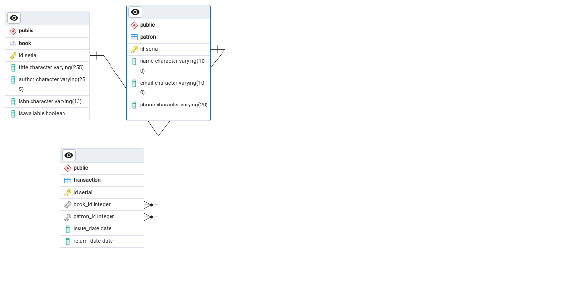

https://www.loom.com/share/2b2ebe8e891c4befbe9916f067cbdec6?sid=d8f3637d-9c5b-4c80-b474-180ef736d186

# Library Management System Project Requirements

## Table of Contents

1. [Introduction](#introduction)
2. [Project Overview](#project-overview)
3. [Requirements](#requirements)
   1. [Functional Requirements](#functional-requirements)
   2. [Non-Functional Requirements](#non-functional-requirements)
4. [Design Constraints](#design-constraints)
5. [Assumptions and Dependencies](#assumptions-and-dependencies)
6. [ERD (Entity-Relationship Diagram)](#erd-entity-relationship-diagram)
7. [Milestones and Deliverables](#milestones-and-deliverables)
8. [Appendices](#appendices)

## Introduction

### Purpose

Provision of comprehensive overview of the requirements for the Library Management System project.

### Scope

The project will develop a system to manage library operations, including user management, book management, and transaction management.

### Objectives

1. Implement a comprehensive library management system.
2. Apply object-oriented programming principles for flexible and scalable code.
3. Utilize essential data structures to optimize library operations.
4. Design and implement a normalized database schema.
5. Develop SQL skills for efficient database manipulation.

### Description

The Advanced Library Management System aims to efficiently manage library resources and operations using JavaFX for a user-friendly interface.

### Stakeholders

- Library Staff
- Patrons

## Requirements

### Functional Requirements

- **User Management:** Registering Patrons
- **Book Management:** Add, update, delete, and search for books.
- **Transaction Management:** Issue, return

### Non-Functional Requirements

- **Usability:** The system should be user-friendly.
- **Reliability:** The system should be reliable and available during library hours.
- **Performance:** Handle concurrent users efficiently.

## Design Constraints

- **Technology Stack:** Java, JavaFX, MySQL, JDBC.
- **Standards Compliance:** Comply with relevant standards and regulations.

## Assumptions and Dependencies

- Users will have access to the internet.
- External dependencies include third-party libraries and external databases.

## ERD (Entity-Relationship Diagram)

## Milestones and Deliverables

Planning and Setup - Define project requirements and objectives. - Set up development environment (IDE, database, JavaFX). - Design database schema and create necessary tables. - Implement basic class structure for library entities.

Object-Oriented Programming and Data Structures - Implement remaining class functionalities with OOP principles. - Implement linked lists for managing book lists and patron records. - Implement stacks and queues for transaction management.
Database Design and SQL Skills

    - Finalize database schema design and normalization.
    - Write SQL queries for creating tables, inserting data, and basic CRUD operations.
    - Integrate JDBC for database connectivity and execute SQL statements from Java code.

User Interface and Integration

    - Develop JavaFX user interface for library management system.
    - Integrate UI with backend functionality (OOP, data structures, database).
    - Conduct thorough testing and debugging.
    - Finalize project documentation and prepare for submission.

## Appendices

### Glossary

- **OOP:** Object-Oriented Programming
- **JDBC:** Java Database Connectivity

### References

- JavaFX Documentation
- POSTGRESQL Documentation

## Getting Started

Welcome to the VS Code Java world. Here is a guideline to help you get started to write Java code in Visual Studio Code.

## Folder Structure

The workspace contains two folders by default, where:

- `src`: the folder to maintain sources
- `lib`: the folder to maintain dependencies

Meanwhile, the compiled output files will be generated in the `bin` folder by default.

> If you want to customize the folder structure, open `.vscode/settings.json` and update the related settings there.

## Dependency Management

The `JAVA PROJECTS` view allows you to manage your dependencies. More details can be found [here](https://github.com/microsoft/vscode-java-dependency#manage-dependencies).